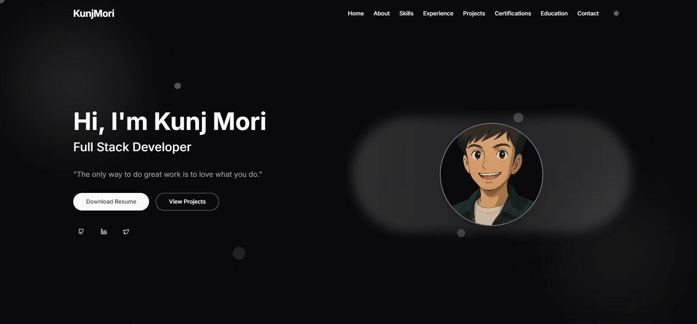

# Modern Portfolio Website

A modern, responsive portfolio website built with Next.js, TypeScript, and Tailwind CSS. This portfolio showcases my skills, projects, certifications, and professional experience with a clean and minimalist design.



## ✨ Features

### 🎯 Key Sections
- **Skills Showcase**: Interactive skill cards with category filtering (Web App, Mobile App, UI/UX, Other)
- **Project Gallery**: Responsive project grid with detailed project information
- **Certifications**: Professional certifications with detailed descriptions and verification links
- **Experience Timeline**: Professional journey with key achievements
- **Contact Form**: Interactive contact form with validation

### 💡 Technical Highlights
- **Modern Tech Stack**: Built with Next.js 14, TypeScript, and Tailwind CSS
- **Responsive Design**: Fully responsive across all device sizes
- **Animations**: Smooth animations and transitions using Framer Motion
- **Dark Mode**: Built-in dark mode support
- **Performance Optimized**: Optimized for fast loading and smooth performance
- **SEO Ready**: SEO optimized with meta tags and semantic HTML

## 🚀 Getting Started

### Prerequisites
- Node.js (v18 or higher)
- npm or yarn

### Installation

1. Clone the repository
```bash
git clone https://github.com/yourusername/portfolio.git
```

2. Install dependencies
```bash
cd portfolio
npm install
# or
yarn install
```

3. Run the development server
```bash
npm run dev
# or
yarn dev
```

4. Open [http://localhost:3000](http://localhost:3000) in your browser

## 🛠️ Built With

- [Next.js](https://nextjs.org/) - React framework for production
- [TypeScript](https://www.typescriptlang.org/) - Static type checking
- [Tailwind CSS](https://tailwindcss.com/) - Utility-first CSS framework
- [Framer Motion](https://www.framer.com/motion/) - Animation library
- [Lucide Icons](https://lucide.dev/) - Beautiful icons
- [Shadcn UI](https://ui.shadcn.com/) - UI components

## 📂 Project Structure

```
portfolio/
├── app/                   # Next.js app directory
├── components/           # React components
│   ├── ui/              # UI components
│   ├── sections/        # Page sections
│   └── shared/          # Shared components
├── lib/                 # Utility functions
├── public/              # Static assets
└── styles/             # Global styles
```

## 🎨 Customization

1. **Personal Information**: Update `data/` directory files with your information
2. **Styling**: Modify `tailwind.config.js` for theme customization
3. **Content**: Edit components in `components/sections/` for section content
4. **Images**: Replace images in `public/` directory

## 📱 Features in Detail

### Skills Section
- Category-based filtering
- Animated skill cards
- Interactive icons
- Responsive grid layout

### Projects Section
- Project filtering by category
- Image galleries
- Live demo links
- GitHub repository links
- Technology tags

### Certifications
- Certification details
- Verification links
- Skills gained
- Interactive cards

### Experience Timeline
- Professional history
- Key achievements
- Company details
- Interactive timeline

## 🤝 Contributing

Contributions are welcome! Please feel free to submit a Pull Request.

## 📄 License

This project is licensed under the MIT License - see the [LICENSE](LICENSE) file for details

## 📬 Contact

Your Name - [your.email@example.com](mailto:your.email@example.com)

Project Link: [https://github.com/yourusername/portfolio](https://github.com/yourusername/portfolio)

---
⭐️ If you like this project, please give it a star! 